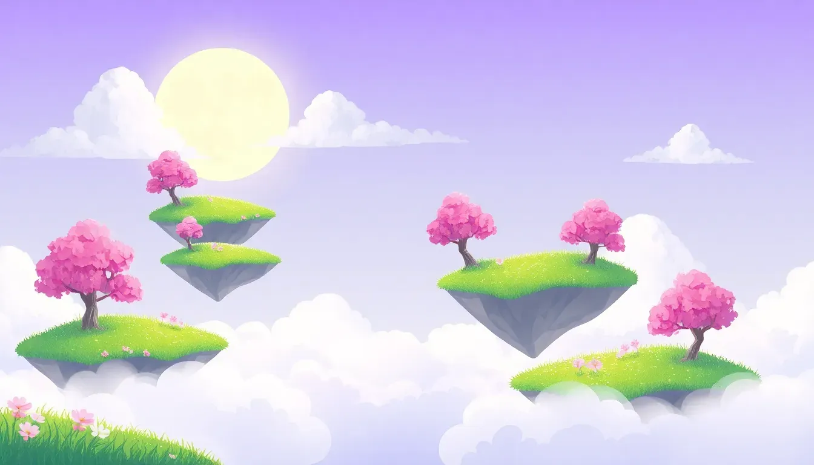

<div align="center">
  
  <h1>Glinth</h1>
  <p><em>A Dreamer's Odyssey</em></p>
  <p>
    <a href="https://juliaragibeltrao.github.io/glinth/">
      <strong>Play Now »</strong>
    </a>
  </p>
  <br>
  
</div>

---

## About

**Glinth** is a meditative puzzle game built with [Phaser 3](https://phaser.io/) and [Tone.js](https://tonejs.github.io/). Guide **Nova** through three dreamlike realms, align mystical orbs to their pedestals, and collect fragments of a forgotten memory — all while immersed in a procedurally generated soundscape.

## How to Play

| Key | Action |
|---|---|
| `W A S D` / Arrow Keys | Move Nova |
| `Hold SPACE` | Attract nearby orbs (hold longer for stronger pull) |
| `ESC` | Pause / Skip cutscene |

### Objective

- Push the **crystals (orbs)** into the **pedestals (slots)** scattered across the map
- Once all orbs are aligned, a **Glinth** (memory fragment) appears — collect it
- Bring the Glinth to the **Altar** to awaken the portal and advance to the next realm

Be careful! **Shadow crystals** patrol each realm. Touching them costs a life. Lose all three lives and the map restarts.

## Realms

| Realm | Difficulty | Orbs |
|---|---|---|
| **The Mystical Shallows** | Gentle | 3 |
| **Autumnal Echoes** | Tricky | 5 |
| **The Chronos Void** | Intense | 6 |

Each realm features unique particle effects, ambient colors, and a fragment of Nova's lost memory.

## Tech Stack

- **Phaser 3.70** — Game engine (arcade physics, particles, tweens)
- **Tone.js 14.7** — Procedural audio (no audio files needed)
- **ES Modules** — Modern JavaScript architecture
- **WebP** — Optimized image assets

## Running Locally

```bash
# Serve the project directory
python -m http.server 8000

# Open in browser
open http://localhost:8000
```

Or simply open `index.html` in your browser (CORS may block some assets).

## Credits

Built with care by [Júlia Ragi](https://github.com/juliaragibeltrao).
